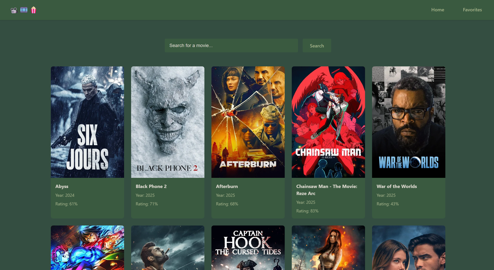

#  Movie Browser App

A simple React application that displays movies fetched from The Movie Database (TMDb) API, allowing users to view details, check ratings, and manage their favorite movies.

---

##  Features

-  Display movie posters, titles, release years, and ratings  
-  Add or remove movies from your favorites list  
-  Persist favorite movies using React Context  
-  Clean and modern UI with overlay favorite button  

---

  

